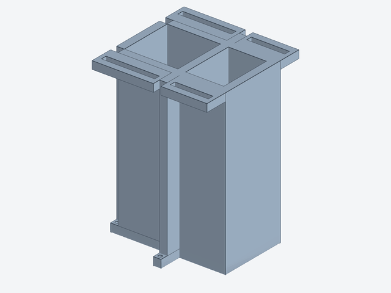
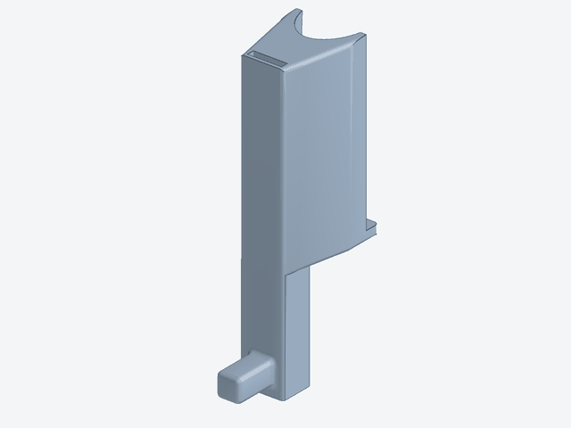
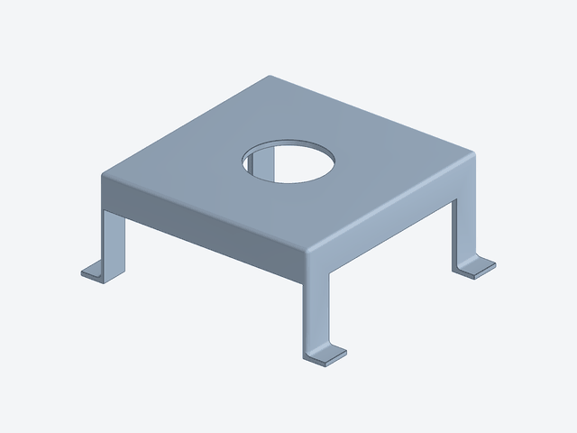
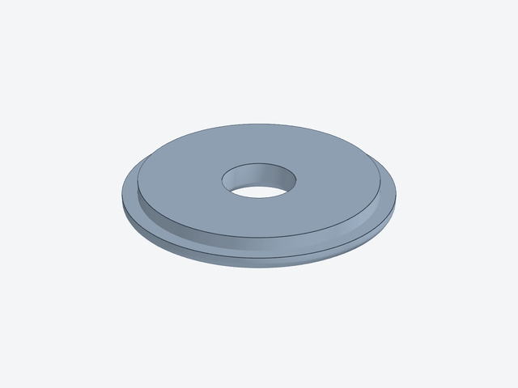
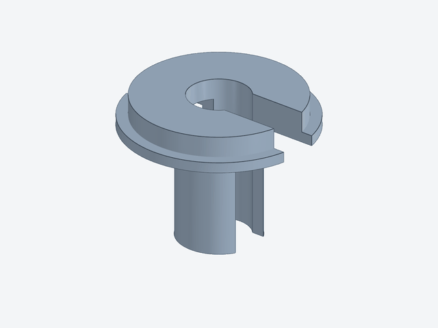
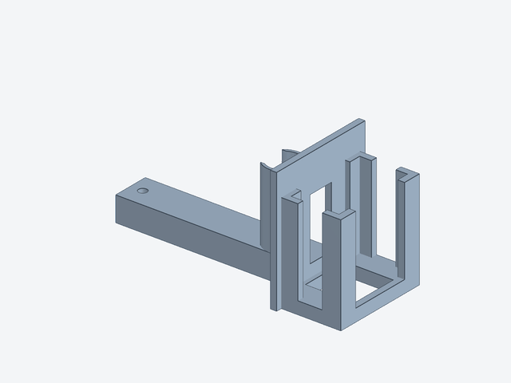
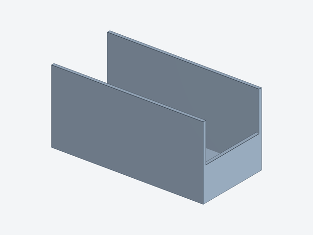
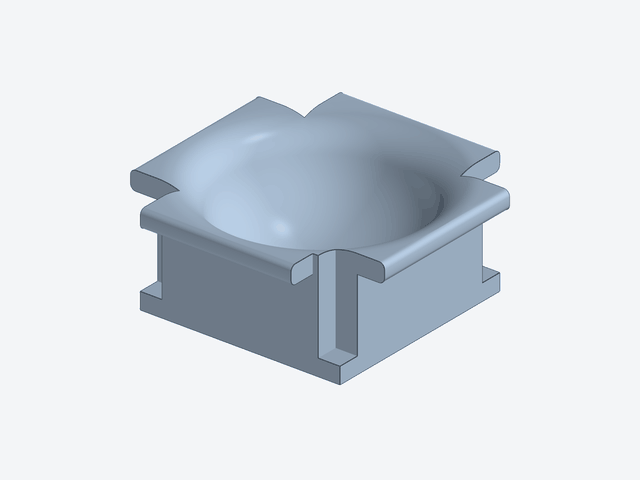
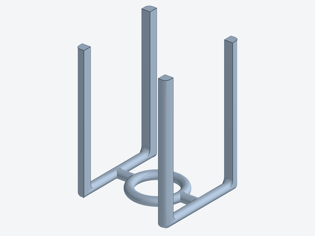
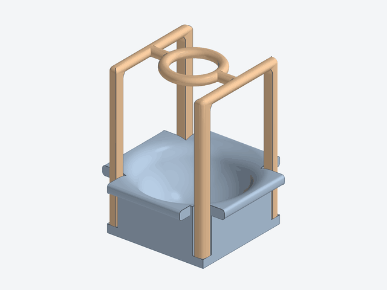

# CAD design bank

3D-printable experimental components. All models were designed with Autodesk
Fusion 360 and printed on a Bambu Lab X1E.

**License: CC BY 4.0** (https://creativecommons.org/licenses/by/4.0/).
You may share and adapt these models, including commercially, with attribution
to the designers listed below and to the paper (see repository README).

## Gallery

Click a picture to open the STL in GitHub's built-in 3D viewer, where the model
can be rotated and zoomed in the browser.

<table>
<tr>
<td align="center" width="33%"> <b>Robot-arm pedestal</b> 150 × 150 × 211 mm · <a href="robot-arm-holder/dobot_magician_holder_210mm.stl">3D view</a></td>
<td align="center" width="33%"> <b>Pipette holder (Picus 2)</b> 32 × 67 × 135 mm · <a href="pipette-holder/picus2_holder.stl">3D view</a></td>
<td align="center" width="33%"> <b>Balance cover (BCE822i)</b> 275 × 240 × 109 mm · <a href="balance-cover/balance_cover_bce822i.stl">3D view</a></td>
</tr>
<tr>
<td align="center" width="33%"> <b>Adapter: No. 4 screw-cap vial</b> 92 × 92 × 10 mm · <a href="balance-cover/adapters/vial_adapter_screw_no4.stl">3D view</a></td>
<td align="center" width="33%"> <b>Adapter: 50 mL centrifuge tube</b> 90 × 92 × 70 mm · <a href="balance-cover/adapters/tube_adapter_centrifuge_50ml.stl">3D view</a></td>
<td align="center" width="33%"> <b>Imaging stand</b> 204 × 90 × 100 mm · <a href="imaging-stand/imaging_stand_assembly.stl">3D view</a></td>
</tr>
<tr>
<td align="center" width="33%"> <b>Imaging-stand light shield</b> 250 × 120 × 120 mm · <a href="imaging-stand/imaging_stand_light_shield.stl">3D view</a></td>
<td align="center" width="33%"> <b>Vessel holder, base (500 mL)</b> 140 × 140 × 59 mm · <a href="vessel-holder/vessel_holder_bottom_500ml.stl">3D view</a></td>
<td align="center" width="33%"> <b>Vessel holder, upper frame (500 mL)</b> 110 × 110 × 160 mm · <a href="vessel-holder/vessel_holder_top_500ml.stl">3D view</a></td>
</tr>
</table>

 
Vessel holder assembled: the upper frame (shown in a second colour) is turned
over and its four posts slide down the corner grooves of the base.

## Designers

| Designer | Affiliation | Contact | Components |
|---|---|---|---|
| Takaya Muramoto (村元貴哉) | Graduate School of Engineering, Tohoku University | muramoto.takaya.s1@dc.tohoku.ac.jp | `pipette-holder/` |
| Yusuke Hashimoto (橋本佑介) | Frontier Research Institute for Interdisciplinary Sciences, Tohoku University | yusuke.hashimoto.b8@tohoku.ac.jp | `robot-arm-holder/`, `balance-cover/` (cover and adapters), `imaging-stand/` |

Questions about a model, or corrections to it, go to its designer.

## Components

Every part is provided as a binary STL (millimetres, exported from Fusion 360),
ready to slice, and — where available — as the editable Fusion 360 source.
Bounding boxes are taken from the meshes.

| Directory | Component | Print file | Editable source | Size X × Y × Z (mm) | Designer |
|---|---|---|---|---|---|
| `robot-arm-holder/` | Pedestal that fixes the robot arm (Dobot Magician) to the bench and raises it by 210 mm | `dobot_magician_holder_210mm.stl` | `dobot_magician_holder_210mm.f3d` | 150 × 150 × 211 | Y. Hashimoto |
| `pipette-holder/` | Holder fixing the electric pipette (Sartorius Picus 2) to the robot arm tip | `picus2_holder.stl` | `picus2_holder.f3d` | 32 × 67 × 135 | T. Muramoto |
| `balance-cover/` | Liquid-splash cover for the electronic balance (Sartorius BCE822i), with windshield; its top plate has a Ø82 mm opening for the vessel adapters below | `balance_cover_bce822i.stl` | `balance_cover_bce822i.f3d` | 275 × 240 × 109 | Y. Hashimoto |
| `balance-cover/adapters/` | Vessel adapter for the cover opening: ring for a No. 4 screw-cap vial (13.5 mL; e.g. AS ONE 9-852-06), Ø25 mm chamfered hole | `vial_adapter_screw_no4.stl` | `vial_adapter_screw_no4.f3d` | 92 × 92 × 10 | Y. Hashimoto |
| `balance-cover/adapters/` | Vessel adapter for the cover opening: sleeve for a 50 mL centrifuge tube, Ø30 mm bore | `tube_adapter_centrifuge_50ml.stl` | `tube_adapter_centrifuge_50ml.f3d` | 90 × 92 × 70 | Y. Hashimoto |
| `imaging-stand/` | Holding stand for the appearance-imaging system (light, sample, camera) | `imaging_stand_assembly.stl` (one mesh of the whole assembly) | `imaging_stand_assembly.f3z` (Fusion archive: stand, assembly and light fixture designs) | 204 × 90 × 100 | Y. Hashimoto |
| `imaging-stand/` | Light shield placed over the imaging stand | `imaging_stand_light_shield.stl` | `imaging_stand_light_shield.f3d` | 250 × 120 × 120 | Y. Hashimoto |
| `vessel-holder/` | Two-part holder for a 500 mL round-bottom vessel, base: block with a spherical seat (Ø105 mm) and a groove at each corner for the posts of the upper frame | `vessel_holder_bottom_500ml.stl` | `vessel_holder_bottom_500ml.f3d` | 140 × 140 × 59 | <!-- TODO: designer --> |
| `vessel-holder/` | Two-part holder for a 500 mL round-bottom vessel, upper frame: four 10 mm posts joined by a ring (Ø44 mm bore) that surrounds the vessel neck. The frame gives a robot arm or a lift something to hook, so that the holder can be carried with the vessel in it; exported ring-down, used ring-up | `vessel_holder_top_500ml.stl` | `vessel_holder_top_500ml.f3d` | 110 × 110 × 160 | <!-- TODO: designer --> |

Notes:

- The two vessel adapters share the same seat: a Ø92 mm flange resting on the top
  plate of the balance cover and a Ø81 mm spigot that drops into its Ø82 mm opening,
  so they are interchangeable without modifying the cover. Print one per vessel
  type you use.
- `.f3d` is a single Fusion 360 design; `.f3z` is a Fusion 360 archive that bundles
  an assembly with the designs it references. Open either with *File → Open* in
  Fusion 360 (upload to your project).
- The meshes were checked to be closed (no open edges). `dobot_magician_holder_210mm.stl`
  is exported from a multi-body design, so a few internal faces are shared between
  touching bodies; slicers merge these, but re-export from the `.f3d` if your tool
  complains about non-manifold edges.
- The original file names were Japanese; they were renamed to ASCII for portability.
  Same geometry.
- The pictures in `previews/` are rendered from the STL files by
  [`tools/render_previews.py`](tools/render_previews.py) (needs `pyvista` and `pillow`);
  re-run it after adding or changing a part.
- The upper frame of the vessel holder rests on the 9 mm ledges at the foot of the
  corner grooves, which puts its ring about 160 mm above the bench. A round-bottom
  vessel cannot stand or be gripped on its own; the frame is the handling point
  when the vessel is moved by a robot arm or a lift.
- STEP exports are not included; export them from the `.f3d` / `.f3z` sources if you
  need a neutral format.

<!-- TODO: add recommended print settings (material, layer height, infill) per component. -->
